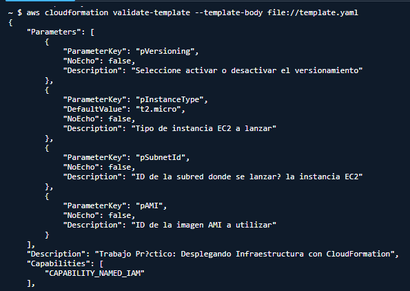
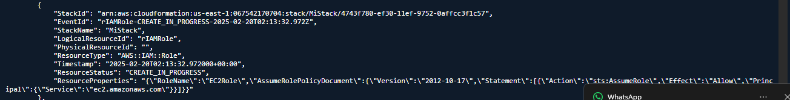
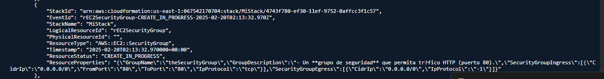
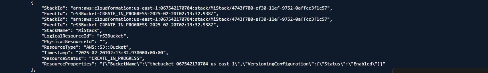
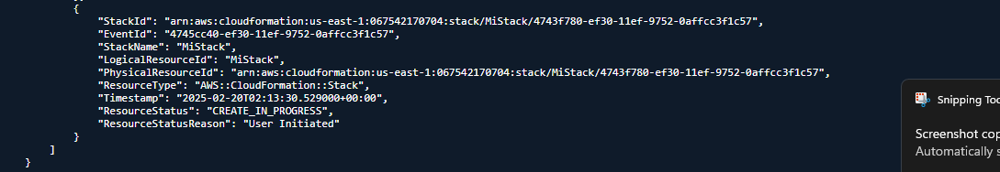
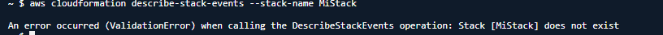

# Desplegando Infraestructura con CloudFormation

## Descripción

Este proyecto implementa una infraestructura básica en AWS utilizando CloudFormation. A través de una plantilla YAML, se crean y despliegan los siguientes recursos:

- Un bucket S3 con versionamiento activado.

- Un grupo de seguridad que permite tráfico HTTP (puerto 80).

- Una instancia EC2 que utiliza este grupo de seguridad.

## Requisitos

### Para ejecutar este proyecto, necesitas:

- Una cuenta de AWS con permisos para gestionar CloudFormation.

- Tener instalada la AWS CLI.

- Configurar credenciales de AWS con aws configure.

- Git para clonar y administrar el repositorio.

### Instalación y Uso

#### 1. Clonar el repositorio

```bash
git clone https://github.com/TheZombie272/cloudFormation_practices
```


#### 2. Crear el stack en AWS

Ejecuta el siguiente comando en la terminal:

aws cloudformation create-stack --stack-name MiStack --template-body file://template.yaml --capabilities CAPABILITY_NAMED_IAM

Esto iniciará el proceso de despliegue en AWS.

##### recordar los parameters



#### 3. Verificar el stack

Puedes comprobar el estado del stack en la consola de AWS en la sección CloudFormation o con el comando:

```bash
 aws cloudformation describe-stack-events --stack-name MiStack
```

##### Ejemplo del stack comprobado







#### 4. Eliminar la infraestructura

Para eliminar los recursos creados, ejecuta:

```bash
aws cloudformation delete-stack --stack-name MiStack
```



## Estructura del Proyecto

.
├── template.yaml  # Plantilla de CloudFormation
├── README.md      # Documentación del proyecto
└── screenshots/   # Capturas de pantalla del stack en AWS


## Autor

Daniel Fernando Flores Arroyave

## Licencia

Este proyecto es de uso libre bajo la licencia MIT.

